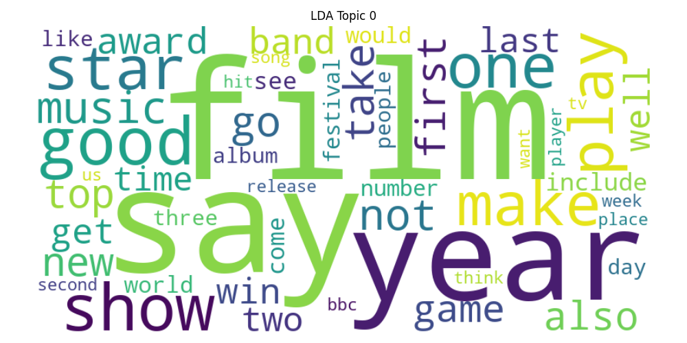
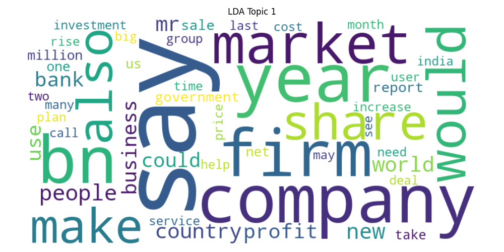
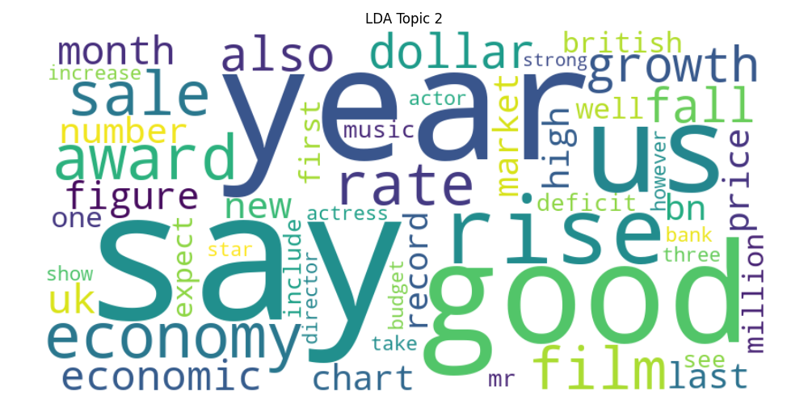
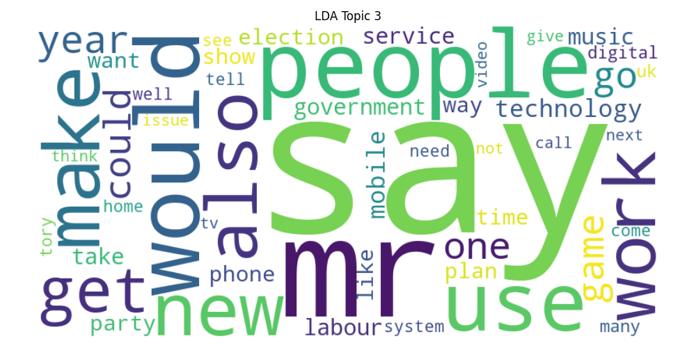
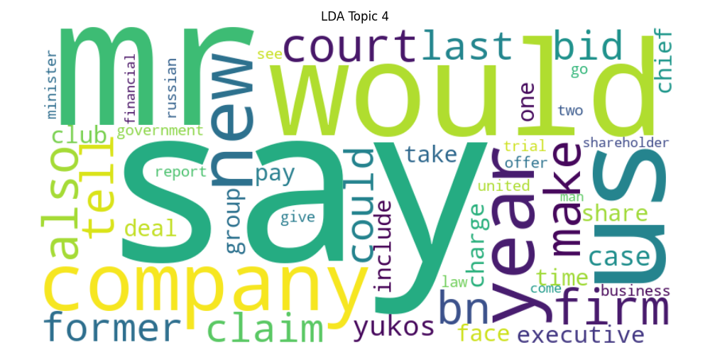
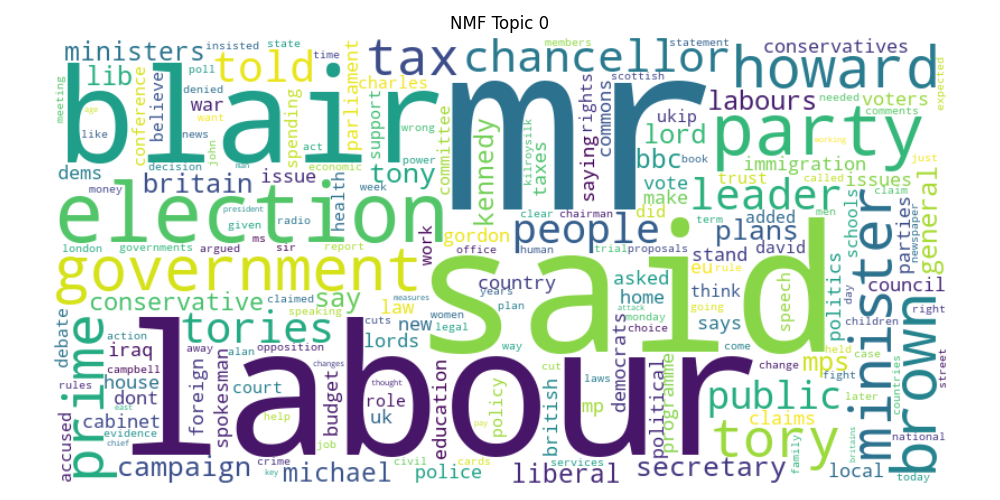
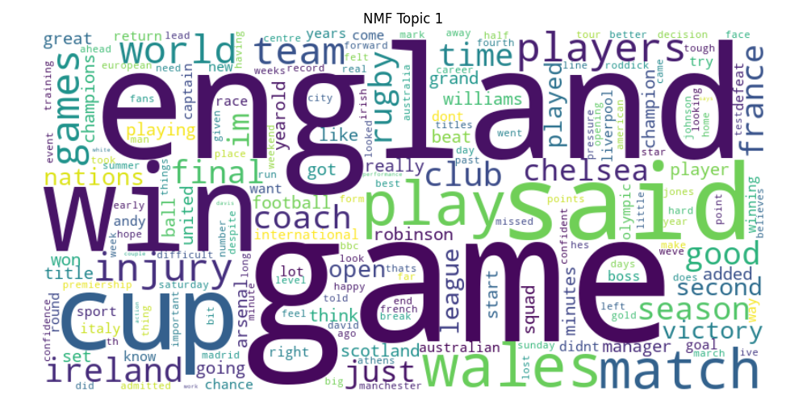
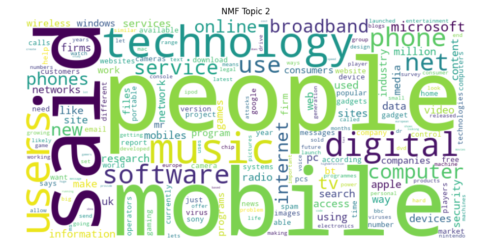
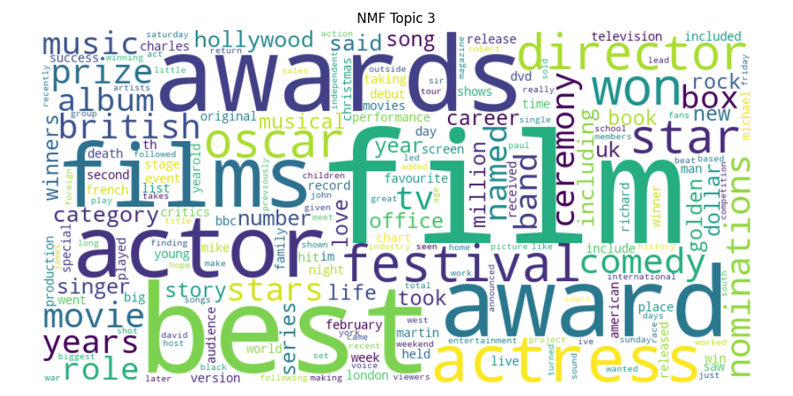
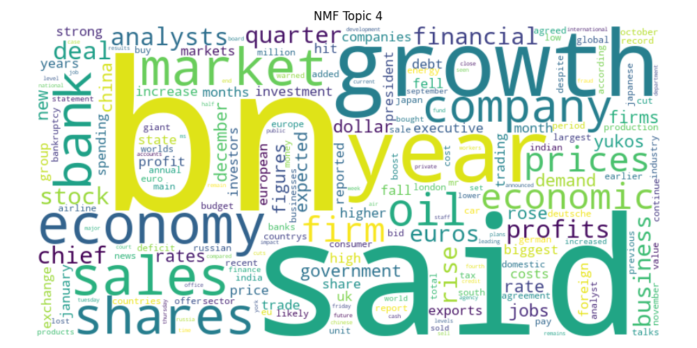

# 📰 BBC News Topic Modeling

Discover hidden topics and themes from BBC News articles using **Unsupervised NLP** techniques: **LDA** and **NMF**. Explore insights, visualize topics, and compare model performance! 🚀

---

## 📂 Dataset
We use the [BBC News Dataset (Kaggle)](https://www.kaggle.com/datasets/sahilkirpekar/bbcnews-dataset).  
The dataset contains news articles categorized into topics such as sports, politics, business, technology, and entertainment.

---

## 🛠️ Tools & Libraries
- Python 🐍  
- Gensim  
- Scikit-learn  
- NLTK / spaCy  
- pyLDAvis  
- WordCloud  

---

## 📝 Preprocessing
- Tokenization  
- Lowercasing  
- Stopword removal  

---

## 📊 Topic Modeling
We applied two unsupervised NLP techniques:

1. **Latent Dirichlet Allocation (LDA)**  
2. **Non-negative Matrix Factorization (NMF)**  

Both models extract dominant topics and display the most significant words per topic.

---

## 🖼️ Results / Visualizations

### LDA Visualization
The interactive LDA visualization is saved as:
`lda_visualization.html`

Open it in a browser to explore topic-term relationships. 🌐

### WordClouds

**LDA Topics:**






**NMF Topics:**






Each image visually represents the most significant words for the topic. 🌟

---

## 📈 Model Performance

- **LDA Coherence Score:** 0.3530  
- **NMF Reconstruction Error:** 45.8986  

Compare model performance to understand which approach captures topics more clearly. 🔍

---

## 🚀 Usage

1. Clone the repo:

```bash
git clone https://github.com/your-username/bbc-news-topic-modeling.git
cd bbc-news-topic-modeling
```
2. Install required packages

3. Run the notebook or Python script:
```bash
python topic_modeling.py
```
WordClouds and LDA visualizations are saved automatically. ✅

---

## ⚖️ License

This project is licensed under the MIT License. 📝

---

### Made with ❤️ and ☕ by Adel
